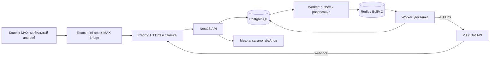

# 01. Архитектура, технологии, MAX и репозиторий

## 1. Целевая схема



**Модульный монолит:** backend разбит по бизнес-областям, но собирается из одного набора пакетов. API обслуживает HTTP; worker исполняет фоновые задания. Оба используют одинаковые доменные операции и миграции. В P0 нет сетевых вызовов между «сервисом записи» и «сервисом купонов»: им нужна одна транзакция.

Пять постоянно работающих контейнеров: `edge`, `api`, `worker`, `postgres`, `redis`. `migrate` — одноразовый контейнер перед запуском. В dev добавляются `web-dev`, mock MAX и тестовые процессы. PostgreSQL хранит бизнес-данные, входящие события, outbox и состояние доставки; Redis ускоряет исполнение очереди и координирует лимиты.

Один origin, например `https://salons.example.ru`: `/` — SPA, `/api/v1/*` — API, `/integrations/max/webhook` — webhook, `/media/*` — только опубликованные изображения. Имя домена — пример, реальный адрес выбирает координатор на D0. Внутри MAX не нужны отдельный сайт администратора и отдельный логин.

## 2. Стек — один выбранный вариант

Ниже конкретные продукты и целевые ветки. **Это проектный baseline, а не проверенный lockfile.** На D0 задача INF-01 фиксирует точные доступные patch-версии и образы, проверяет peer dependencies и сборку; далее обновления только отдельным PR. `latest`, `^` и `~` в итоговых manifest не использовать. Ветка `main` чужой библиотеки не равна опубликованному npm-релизу.

| Область | Выбор | Как используем |
|---|---|---|
| Runtime | Node.js 24 LTS, Debian bookworm-slim | Общий runtime API, worker и сборки; актуальный patch ветки фиксировать вместе с digest образа |
| Язык | TypeScript 5.9.x, strict | Консервативный baseline для Nest decorator metadata; `noUncheckedIndexedAccess`, запрет `any` на внешних контрактах. Переход на новый major отдельно, не через latest |
| Монорепозиторий | pnpm 10, workspaces | Один lockfile, общие типы, `pnpm --filter`; Nx/Turborepo для данного объёма не требуются |
| Frontend | React 19.2.8 + React DOM той же версии | SPA; клиентский и рабочий режим в одном приложении |
| Сборка frontend | Vite 7.x + официальный React plugin | Статическая production-сборка, локальный proxy API; без SSR |
| Компоненты | `@maxhub/max-ui`, целевой кандидат 0.5.0 | Кнопки, поля, списки, панели, темы; обёртки в `packages/ui`. Проверить опубликованную версию и её точные peer dependencies до freeze |
| Оформление | CSS Modules + CSS variables | Одна салонная тема: палитра, изображения и текст; никакого исполняемого пользовательского HTML |
| Навигация | React Router 7, BrowserRouter | Пути приложения; hash не использовать под роутер, он нужен стартовым данным MAX |
| Запросы UI | TanStack Query 5 | Кеш серверных данных по пользователю/режиму/tenant, повтор чтения, инвалидирование после команд |
| Формы | React Hook Form 7 + Zod 4 | Схемы полей, формы публикации, записи, графика, кампании; сервер повторно проверяет те же DTO |
| Backend | NestJS 11 + Fastify 5 | Контроллеры, DI, guards, exception filter, отдельные модули; Fastify-плагины вместо Express middleware |
| Доступ к БД | `drizzle-orm` 0.44.x + `pg` 8.x | Типизированные запросы, явный `tx`, SQL для сложных блокировок и ограничений |
| Миграции | Drizzle Kit совместимой ветки + проверяемые SQL-файлы | Сгенерированные изменения просматривает человек; exclusion/FK/индексы записываем SQL-миграцией |
| База | PostgreSQL 17, `btree_gist`, `pg_trgm` | Транзакции, связи tenant, запрет пересечения мастера, поиск CRM, агрегаты |
| Очередь | BullMQ 5 + Redis 7.4 | Исполнение доставок; `notification_deliveries` в PostgreSQL остаётся источником истины |
| API-контракт | Zod 4 + `@asteasolutions/zod-to-openapi` 8 | Из общих схем генерируем OpenAPI 3.1; реестр операций в `packages/contracts` |
| HTTP-клиент UI | Собственная небольшая обёртка над fetch | Bearer session, request ID, Idempotency-Key, схемы ответа; без второго набора ручных DTO |
| MAX Bot API | Серверный `fetch` + `MaxApiClient` | Ограниченный набор HTTP-методов; управляем доменом, TLS, rate limit и повторами в одном месте |
| Время | Luxon 3 | IANA timezone, перевод локальных графиков в UTC, календарные дни и DST; clock инъецируется в доменные тесты |
| Изображения | `sharp` 0.34 + файловое хранилище на volume | Проверить формат, удалить EXIF, уменьшить, сохранить WebP; metadata в PostgreSQL |
| QR | `qrcode` 1.5 | Локальная генерация QR из публичной ссылки, без внешнего QR-сервиса |
| Логи/метрики | Pino 9 + prom-client 15 | JSON-логи с редактированием секретов, счётчики API/очередей/ошибок, endpoint метрик во внутренней сети |
| Проверки backend | Vitest 3, Testcontainers Node | Чистая логика отдельно; интеграционные транзакции на настоящем PostgreSQL/Redis |
| Проверки UI | Testing Library, MSW 2, Playwright 1.x | Компоненты, контрактные mocks, браузерные end-to-end пути; реальный MAX проверяем дополнительно |
| Нагрузка | Grafana k6 | 20 виртуальных сессий, профиль данных из ТЗ, p95 и конкурентные сценарии |
| Упаковка | Docker Engine + Compose v2 | Одна команда для локального демо, тот же build artifact для staging |
| Reverse proxy | Caddy 2 | HTTPS, раздача SPA, reverse proxy, ограничение размера запроса; конфигурация в репозитории |
| CI | GitHub Actions | Проверки PR, сборка и образ с commit SHA; выкладка staging по отдельной задаче pipeline |

Node 24 указан как LTS в [официальной таблице релизов](https://nodejs.org/en/about/previous-releases). Nest поддерживает Fastify через [официальный adapter](https://docs.nestjs.com/techniques/performance). Vite используется по [официальному руководству](https://vite.dev/guide/), серверный кеш UI — по [TanStack Query](https://tanstack.com/query/latest/docs/framework/react/overview), транзакционный API — по [Drizzle](https://orm.drizzle.team/docs/transactions).

У MAX UI сейчас есть существенная деталь: общая документация говорит о React 18+, но просмотренный [package.json репозитория](https://raw.githubusercontent.com/max-messenger/max-ui/main/package.json) версии 0.5.0 задаёт точные peers `react/react-dom 19.2.8`. Поэтому выбран этот React-кандидат; INF-01 проверяет npm-артефакт. Не обходить несовместимость `--force` и не устанавливать автоматически React latest. Если опубликованная версия отличается, обновить совместимую пару в решении ADR-001 и lockfile, сохраняя выбранный стек.

Календарь делаем своим: день/неделя на CSS grid, карточки визитов и форма переноса. Сложная resource-calendar библиотека не требуется для 1–15 мастеров и переноса без drag-and-drop. Графики — простые SVG/HTML-столбцы и таблицы; формулы живут на сервере. Все серверные данные — через Query, локальные шаги формы — React state; дополнительный глобальный store пока не нужен.

Redis 7.4 требует проверки условий лицензии конкретного дистрибутива при INF-01; инвентаризация лицензий обязательна для всего стека. Эта рекомендация не является юридическим выводом о конкурсной допустимости.

## 3. Что именно берём у MAX

### 3.1. Платформенные инструменты

| Инструмент | Использование в проекте |
|---|---|
| Кабинет MAX для партнёров / MAX для бизнеса | Проверить выданного бота, привязать HTTPS URL mini-app, кнопку открытия; проверить доступ у тестировщиков |
| MAX Bridge | Получить исходное initData, управлять кнопкой назад, при необходимости поделиться ссылкой; адаптер frontend |
| MAX UI | Общие React-компоненты и нативно выглядящие элементы |
| Bot API | `GET /me`, `GET/POST /subscriptions`, `POST /messages`; для локального polling при отдельной конфигурации — `/updates` |
| Официальный JS SDK `@maxhub/max-bot-api` | Исследован как альтернативный клиент. В P0 не устанавливаем: несколько нужных методов покрывает контролируемый HTTP-adapter |
| Официальный Go SDK | Существует, но второй backend-язык здесь не нужен |
| Гайдлайн интерфейса в Figma | Визуальный референс для навигации и размеров, не runtime-зависимость |

Платформа документирует привязку mini-app к боту и HTTPS-размещение в [руководстве подключения](https://dev.max.ru/docs/webapps/introduction). MAX UI подключается пакетом `@maxhub/max-ui`, провайдером `MaxUI` и стилями — см. [руководство MAX UI](https://dev.max.ru/ui). Официальный SDK и его возможности описаны в [JS-документации](https://dev.max.ru/docs/chatbots/bots-coding/js), исходники — в [max-bot-api-client-ts](https://github.com/max-messenger/max-bot-api-client-ts). Собственный adapter — наше архитектурное решение, а не ограничение SDK.

### 3.2. Frontend adapter

В `apps/web/index.html` перед кодом приложения подключаем `https://st.max.ru/js/max-web-app.js`. Доступ к `window.WebApp` разрешён только внутри `packages/max-bridge`.

Интерфейс адаптера проекта:

```ts
interface MaxBridgePort {
  getRawInitData(): string;
  getClientInfo(): { platform?: string; version?: string };
  bindBack(handler: () => void): () => void;
  shareSalon(url: string, title: string): Promise<'shared' | 'fallback'>;
}
```

Это **наш** интерфейс, не названия методов MAX. Адаптер использует документированные `initData`, `BackButton.onClick/offClick/show/hide`, проверяет наличие методов перед вызовом. При недоступном share показываем копирование ссылки. Не переносить `Telegram.WebApp.ready/expand` в MAX по аналогии. Секреты в Bridge не передаются. `initDataUnsafe` не используется для серверной личности. [MAX Bridge](https://dev.max.ru/docs/webapps/bridge).

Boot-последовательность:

1. Считать raw initData до любых изменений URL и запомнить его только в памяти.
2. Выполнить `POST /api/v1/auth/max` с `{initData}`.
3. Получить session token, срок, собственный профиль и проверенный `launchContext`.
4. Очистить исходные стартовые данные из адресной строки через `history.replaceState`; не отправлять fragment в логи/аналитику.
5. Открыть salon/booking/voucher/invitation или общий кабинет по серверному контексту. Старый выбранный tenant не перекрывает новый startapp.
6. Подключить Router и BackButton. При уходе со страницы удалить обработчик кнопки.
7. После 401 очистить приватный Query cache и показать «Откройте приложение заново в MAX». Просроченные данные не обменивать циклически.

В обычном браузере без initData показывать публичную стартовую страницу с переходом в MAX. Dev identity разрешена только отдельным локальным mock-сервисом в Compose dev; production API не содержит endpoint «войти как user_id».

### 3.3. Проверка личности и сессия

Входная строка должна быть исходным `WebApp.initData`, не JSON из unsafe-объекта. Один URL-decode параметров; отбрасываем повторяющиеся ключи; `hash` исключаем; оставшиеся пары сортируем и соединяем `\n`. Затем:

```text
secret = HMAC_SHA256(key = "WebAppData", data = BOT_TOKEN)
expected = HMAC_SHA256(key = secret, data = canonicalPairs)
```

Сравнение байтов constant-time; hash — 32 байта после hex-decode. JSON поля user разбираем после проверки подписи. Алгоритм и регистр `WebAppData` — по [официальной валидации](https://dev.max.ru/docs/webapps/validation).

Наши дополнительные проверки: размер payload ≤16 KiB, непустые обязательные поля, `auth_date` — целые секунды, возраст ≤3600 секунд, будущее ≤60 секунд. Не переупорядочивать JSON внутри значения `user` перед HMAC. Не включать внешние `WebAppVersion/WebAppPlatform` в подписанную строку. Нужны тесты Unicode, `+`, `%`, повторных полей, испорченного hex и секунд/миллисекунд.

MAX ID храним как `bigint` в БД и decimal string в приложении/API. Серверный парсер JSON внешнего API должен сохранять int64 без округления, например `lossless-json`; нельзя сначала вызвать обычный JSON.parse, потерять точность, а затем превратить number в string. Из user в подписанной строке идентификатор также извлекается без потери точности. Это не касается наших UUID.

Session: случайные 32 байта base64url, в БД только SHA-256 token. Frontend хранит token в памяти и отправляет `Authorization: Bearer ...` **нашему API**. Cookies и refresh token в P0 не используются, чтобы не зависеть от ограничений embedded web-клиента. После перезагрузки повторный exchange возможен только если клиент MAX снова предоставил действующее initData; после очистки fragment это не гарантируется. При отсутствии данных пользователь повторно открывает mini-app из MAX. Такой сценарий проверяется на D0. Новый exchange со старым payload не продлевает абсолютное `expires_at = auth_date + 3600s`.

Роль не закладываем в долгоживущий JWT: актуальный membership читается на каждом запросе. Доступ уже отправленного HTTP-запроса нельзя отозвать задним числом, но commit служебной команды должен перепроверить активную роль в транзакции. Следующий запрос после отзыва — 403/404. Авторизация и scope проверяются и при чтении сохранённого idempotency-result.

### 3.4. Ссылки

Официальная форма: `https://max.ru/<botName>?startapp=<payload>`. Payload — до 512 символов, `A–Z a–z 0–9 _ -`. Для бота `?start=` — другой механизм, с лимитом 128 символов. [Mini-app deep links](https://dev.max.ru/docs/webapps/introduction), [bot deep links](https://dev.max.ru/docs/chatbots/bots-coding/prepare).

Наши payload:

| Значение | Назначение и проверка |
|---|---|
| `s_<publicCode>` | Публичный салон; код неизменный, не персональный |
| `b_<opaqueRef>` | Карточка записи; сервер разрешает только владельцу записи/уполномоченному сотруднику |
| `v_<opaqueRef>` | Купон; доступ только владельцу или разрешённой проекции принимающего салона |
| `i_<randomToken>` | Одноразовое приглашение сотрудника |
| `c_<randomToken>` | Подтверждаемая привязка ручной CRM-карточки |

OpaqueRef — случайные 128 бит; invite token — 256 бит. Секретные токены храним хешами; срок приглашения 24 часа. Ссылка сама по себе не заменяет авторизацию. В payload нет телефона, ФИО, роли, цены, разрешений или сериализованного объекта. QR содержит ту же ссылку; сканер камеры не нужен для основного пути.

### 3.5. Серверный adapter MAX

`packages/max-api` экспортирует `getBotInfo`, `getSubscriptions`, `setSubscription`, `sendMessage`, `parseUpdate`. HTTP-транспорт и Zod-схемы внешних ответов находятся здесь; модули CRM/booking о них ничего не знают.

Текущий рекомендуемый адрес — `https://platform-api2.max.ru`. В заголовке Bot API используется `Authorization: <BOT_TOKEN>` без префикса Bearer. `POST /messages?user_id=<decimalId>` отправляет личное сообщение; кнопка-ссылка ведёт на наш startapp. API ограничивает сообщения в один диалог двумя в секунду. [Метод отправки](https://dev.max.ru/docs-api/methods/POST/messages).

Внешние запросы: timeout 5 секунд, отмена через AbortController. Внутри transport нет скрытых повторов — ими управляет delivery state machine. Неизвестный ответ сохраняем как техническую ошибку без полного тела с персональными данными. Текст отправляем plain text, без произвольной HTML-разметки; в каждом сообщении есть название салона.

Все вызовы, включая служебные `/me` и проверку подписки, проходят общий распределённый limiter. Проектная настройка — 25 запросов/сек на бота, 1 сообщение/сек на диалог. Потолки 30 и 2 не превышаем. Общий лимит API указан в [руководстве Bot API](https://dev.max.ru/docs/chatbots/bots-coding/prepare). Настройки ниже потолка оставляют запас; детали limiter — документ 02.

Документация API требует учитывать сертификат Минцифры. В INF-02 проверить TLS именно из production Docker-образа; при необходимости добавить проверенный CA bundle в системное хранилище и `NODE_EXTRA_CA_CERTS`. Источник и checksum сертификата фиксирует ответственный. Не использовать `NODE_TLS_REJECT_UNAUTHORIZED=0` и не отключать проверку сертификата. [Требования MAX API](https://dev.max.ru/docs-api/methods/GET/me).

### 3.6. Webhook

Endpoint: `POST /integrations/max/webhook`. Настраиваем подписку на `bot_started`, `bot_stopped`, `dialog_removed`, `message_created`. Callback-кнопки не нужны: доменные изменения происходят в mini-app. Неизвестные типы сохраняем как проигнорированные, не превращаем их в команды.

Схема приёма: проверить `X-Max-Bot-Api-Secret` constant-time → проверить размер/формат → надёжно сохранить inbox → вернуть 200. Ошибка БД — 503; неверный секрет — 403. Повтор уже сохранённого события — 200. Обработка и исходящие сообщения выполняются отдельно. Проектная цель ответа <2 секунд.

Платформа требует HTTPS:443, доверенную полную цепочку сертификатов и ответ в течение 30 секунд; одновременно polling не работает. После длительных ошибок возможна автоматическая отписка, поэтому worker раз в 5 минут сверяет `GET /subscriptions` и отмечает потерю подписки как сбой интеграции. [Контракт webhook](https://dev.max.ru/docs-api/methods/POST/subscriptions).

Канал имеет состояния unknown/active/stopped/removed. `bot_started` активирует, `bot_stopped` останавливает, `dialog_removed` помечает удаление. Обновления могут повторяться и приходить с задержкой; применяем по timestamp, при равном времени остановка/удаление сильнее старта. `dialog_muted` не тождествен остановке. [Объект Update](https://dev.max.ru/docs-api/objects/Update).

При старте бота отправляется только актуальное приветствие с кнопкой приложения как ответ на действие пользователя; оно не включает маркетинговые разрешения и не запускает рассылку накопленного. Сервисные сообщения требуют отдельной настройки. До первого подтверждённого active-канала всё видно в mini-app; UI предлагает открыть/запустить бот. Факт открытия mini-app не меняет stopped на active.

## 4. Структура репозитория

```text
salons-max/
  apps/
    web/
      index.html
      src/
        app/                  # bootstrap, router, providers, error boundary
        pages/                # сборка экранов из features
        features/
          auth/ salons/ storefront/ booking/ personal-calendar/
          work-calendar/ crm/ staff/ notifications/ analytics/ partnerships/
        shared/               # форматирование, HTTP, UI glue; без доменной логики
    api/
      src/main.ts
      src/app.module.ts
      src/controllers/        # HTTP adapters, guard и DTO mappings
    worker/
      src/main.ts
      src/processors/         # inbox, outbox, delivery, reconciliation, housekeeping
  packages/
    contracts/                # Zod DTO, enums, errors, operation registry, OpenAPI
    backend/
      src/modules/
        identity/ tenants/ access/ catalog/ scheduling/ crm/
        bookings/ partnerships/ notifications/ analytics/ audit/ media/
      src/application/        # orchestration use cases для нескольких модулей
      src/infrastructure/     # db, clock, locks, logger, unit-of-work
    db/
      src/schema/
      migrations/             # единая упорядоченная история SQL
      seeds/                  # синтетические fixtures и сценарии
    max-api/                  # серверный MAX adapter; secret только здесь/identity
    max-bridge/               # браузерный adapter и dev mock
    ui/                       # обёртки MAX UI, общие состояния и тема
    config/                   # общие TS/ESLint и server env schema
    test-kit/                 # fixtures, fake clock, test DB helpers
  tests/
    integration/ e2e/ load/ max-smoke/
  ops/
    docker/                   # Dockerfile.api, worker, web, Caddyfile
    scripts/                  # bootstrap, release, backup, restore, max-check
  docs/
    architecture/ adr/ runbooks/ acceptance/
  .github/workflows/
  .env.example
  .dockerignore
  compose.yaml
  compose.dev.yaml
  pnpm-workspace.yaml
  pnpm-lock.yaml
  README.md
  DATA-API.yaml
```

Каждый backend-модуль содержит `domain/` (правила), `application/` (use cases), `infrastructure/` (repositories), `module.ts` и `index.ts` (доступный публичный интерфейс). Не создавать эти подпапки пустыми «для красоты»: они появляются вместе с кодом.

Пример полного пути изменения: `BookVisitForm` → общий контракт `CreateBookingRequest` → `BookingsController.create` → `CreateBooking.execute` → `BookingRepository` + `VoucherService.reserve(tx)` → commit → ответ; worker отдельно отправляет уведомление.

Правила зависимостей:

- `web` импортирует `contracts`, `ui`, `max-bridge`; никогда `db`, `backend`, `max-api`.
- `api` и `worker` импортируют `backend`; предметная логика не копируется в controllers/processors.
- `contracts` не импортирует Nest, React и схему БД. Публичный DTO не равен ORM row.
- Один модуль не пишет в таблицы другого напрямую. Для общей транзакции вызывает публичную команду с переданным `tx`.
- Application orchestrator координирует booking+voucher+audit+events. Repository не открывает вложенную независимую транзакцию.
- Shared utility не обращается к базе и не вычисляет цену/права. Никакой «магической» папки services на весь проект.
- Межмодульные импорты только через `index.ts`; ESLint ограничивает границы. Секретный env-schema отсутствует в bundle UI.

## 5. Безопасность и эксплуатационные границы

Tenant-изоляция P0: scoped repositories, обязательные составные FK, проверка прав в use case, отдельные DTO по ролям и отрицательные integration tests. RLS здесь не объявляется реализованной второй линией защиты: неверно настроенная политика особенно опасна для общеклиентских и межсалонных операций. Если добавлять RLS позднее — отдельный ADR и тесты; владельцы таблиц/BYPASSRLS имеют особое поведение по [документации PostgreSQL](https://www.postgresql.org/docs/17/ddl-rowsecurity.html).

Операционный DB-user не суперпользователь, не владелец схемы; migrations-user отдельный. Запрет физического удаления аудита и использованной истории в runtime-правах. Вложения доступны через публичные published-ссылки или проверенный API, не по списку файлов volume. Поиск, counts, фоновые задачи и Query cache входят в границу изоляции.

CSP разрешает script со своего origin и `st.max.ru`; конкретные требования к встраиванию веб-MAX фиксируются при D0. Не включать без проверки `X-Frame-Options: DENY`/`frame-ancestors 'self'`, которые могут сломать веб-клиент. Не разрешать произвольные origins для авторизованного CORS. Markdown/описания отображать как текст, URL контакта — только из разрешённых схем. Bearer/session/initData/телефоны/заметки вырезаются из access и error logs.

## 6. Реестр внешних источников

Источники просмотрены 19.09.2026; изменяемые платформенные условия повторно проверить перед сдачей. Ссылки возле соответствующих решений являются основными. Дополнительно:

- [PostgreSQL range types и exclusion constraints](https://www.postgresql.org/docs/17/rangetypes.html) — защита интервалов.
- [BullMQ retry](https://docs.bullmq.io/guide/retrying-failing-jobs) — механизм очереди; retry-политика проекта задаётся нами.
- [BullMQ rate limiting](https://docs.bullmq.io/guide/rate-limiting) — общий limiter очереди; старый groupKey не использовать.
- [Redis persistence](https://redis.io/docs/latest/operate/oss_and_stack/management/persistence/) — AOF и восстановление Redis.

Не заявляем, что локальные unit tests заменяют проверку MAX, или что наличие токена означает доступную mini-app. Итог D0 — отдельный отчёт с устройствами, версиями клиентов, временем и результатом каждого smoke test.
